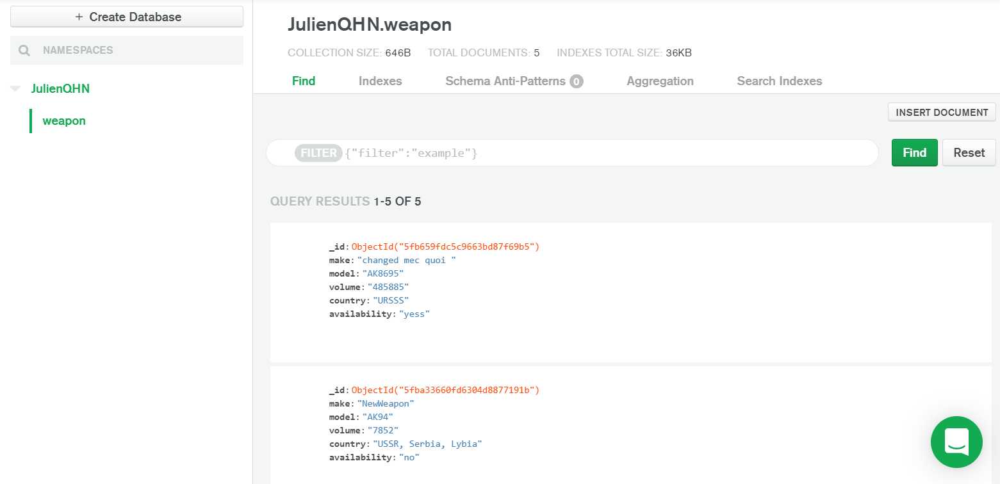

# Atlas MongoDB + Express Database ! 

The objective of this program is to perform CRUD operations using Node, Mongo-Db and Express on a remote database ( Atlas cloud), the database in the example already receive many weapons object in the weapon collection of the JulienQHN database.




### What can you do ? 

You can make the basic CRUD operations like :
  - Connect to your own Data base
  - Get informations from specific collection of the database
  - Make CRUD operations
      - Create an object (insert)
      - Read the list of objectfs or a specific one (find)
      - Update a specific object (update)
      - Delete an object of the collection

### Which http requests does the application respond to ? 

>  The application respond to the following http requests :

> get request: localhost:3000/<your collection> 
(To get all your objects of the specific collection)

> get request: localhost:3000/<your collection>/<id/or any other index>
(To get 1 specific object of the collection by using his _Id)

> post request: localhost:300/<your collection> 
(To insert 1 object with all his parameters in the collection) 

> put request: localhost:3000/<your collection>
(To update 1 specific object, you have to specific his _Id to modify his parameters)

> delete requests: localhost:3000/<your collection>
(To delete 1 specific object of the collection by simply precise his _Id)

### How to Use 
Open your Terminal and run these commands.

First cd to the right folder :
```sh
cd CA1 (or your own folder)
```
Start :
```sh
$ node index.js
```

### How to Test

I used Postman for test every operations of the project :
```sh
GET http://localhost:3000/weapon
GET http://localhost:3000/weapon/id
POST http://localhost:3000/weapon
PUT http://localhost:3000/weapon/id
DEL http://localhost:3000/weapon/id
```
